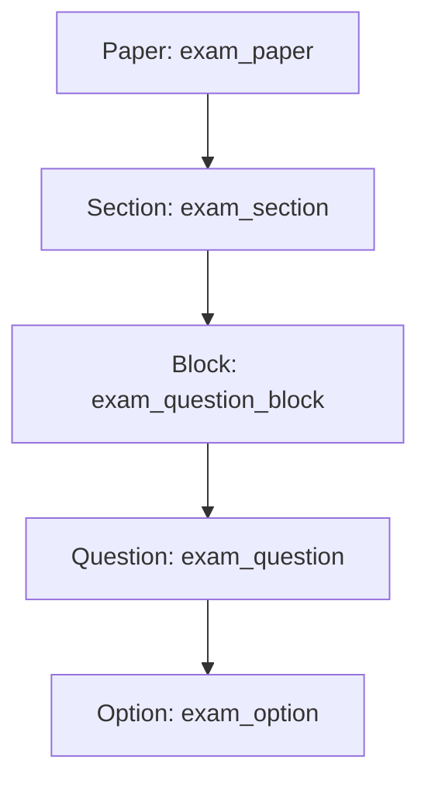
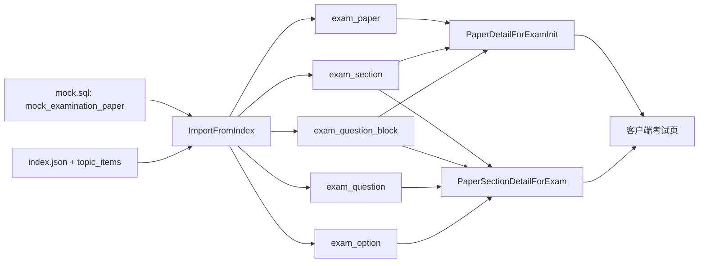

# HSK1-HSK6 试卷结构说明（基于已导入数据）

> 文档版本：v1.1  
> 更新时间：2026-04-20  
> 维护人：Jacky 
> 数据来源：hsk_exam
> 适用范围：New HSK1 ~ New HSK6（不含 YCT、HSKK、旧版 HSK）

---

## 1. 文档目的

- 统一 HSK1-HSK6 试卷的数据结构定义，便于后续开发、联调、排查与数据治理。
- 明确从上游 JSON 到系统结构化存储的字段映射关系。
- 统一统计口径（题量、主客观题、例题、分段结构等）。

### 1.1 本次数据范围与结论边界

- 本文仅关注 New HSK1~6：
  - mock 原始卷：`mock_examination_paper.id` = 193~198。
  - 结构化卷：`exam_paper.id` = 2~7，`level` = `new1`~`new6`。
- 不纳入本次统计：
  - 旧版 HSK（如 `hsk1`）
  - YCT、HSKK 数据。
- 下文所有“题量/分段/题型编码”均以 `examsql.sql` 中已导入结构化数据为准。

---

## 2. 术语与对象层级

### 2.1 术语定义

- Paper（试卷）：一套完整考试数据，包含级别、标题、资源路径、考前信息等。
- Section（大题）：试卷中的一个题型分段（如听力某部分、阅读某部分）。
- Block（题块）：Section 内的题目组织单元，可单题也可套题。
- Question（小题）：最小作答单元。
- Option（选项）：客观题选项（A/B/C/D...）。

### 2.2 统一层级关系

1. Paper
2. Section
3. Block
4. Question
5. Option

---

## 3. 上游 JSON 输入规范

### 3.1 index.json 顶层结构

#### 字段说明（模板）

- title：试卷标题
- prepare：考前信息对象
  - title：考前标题
  - instruction：考前说明
  - audio_file：考前音频
- items：大题数组（Section 列表）

#### items[]（Section 来源）字段

- topic_title：大题标题
- topic_subtitle：大题副标题
- topic_type：题型编码
- part_code：部分编号
- segment_code：分段编码（如 listen/read/write）
- topic_items：题目文件名（指向具体 topic JSON）

### 3.2 topic_items（大题题目文件）结构

#### 顶层字段（模板）

- items：题块数组（Block 列表）

#### items[]（Block 来源）结构规则

- 场景 A：套题块
  - 含 questions 数组
  - 表示一个 Block 下有多道 Question
- 场景 B：单题块
  - 无 questions 数组
  - 当前项即一条 Question

#### Question 常见字段（模板）

- index：题号
- score：分值
- is_example：是否例题
- type：题目内容类型
- content：题干资源（如音频文件）
- content_sentence：题干文本
- screen_text：展示文本（结构化）
- analysis：解析信息（多语言）
- question_description_obj：题目描述对象
- answers：选项数组或答案信息

#### Option 常见字段（模板）

- flag：选项标识（A/B/C...）
- index：选项顺序
- correct：是否正确
- type：选项类型（text/image/html 等）
- content：选项内容

---

## 4. 结构化数据模型（落库/中台模型）

### 4.1 Paper（试卷级）

#### 核心字段

- 业务标识：mock_examination_paper_id
- 上游标识：level、paper_id
- 元信息：title、prepare_title、prepare_instruction、prepare_audio_file
- 资源基址：source_base_url
- 快照：index_json
- 音频切片配置：audio_hls_*
- 考试时长：duration_seconds

### 4.2 Section（大题级）

#### 核心字段

- 关联：exam_paper_id、mock_examination_paper_id
- 顺序：sort_order
- 结构：topic_title、topic_subtitle、topic_type
- 分段：part_code、segment_code
- 来源：topic_items_file
- 快照：topic_json

### 4.3 Block（题块级）

#### 核心字段

- 关联：section_id
- 顺序：block_order
- 组信息：group_index
- 描述：question_description_json

### 4.4 Question（小题级）

#### 核心字段

- 关联：exam_paper_id、mock_examination_paper_id、block_id
- 顺序：sort_in_block
- 题号：question_no
- 分值：score
- 标记：is_example、is_subjective
- 内容：content_type、audio_file、stem_text
- 展示：screen_text_json
- 扩展：analysis_json、question_description_json、raw_json

### 4.5 Option（选项级）

#### 核心字段

- 关联：question_id
- 标识：flag
- 顺序：sort_order
- 判定：is_correct
- 类型：option_type
- 内容：content

---

## 5. 关键业务规则（统一口径）

### 5.1 主客观题判定口径

- is_example = true：按例题处理，不计入正式得分题（按业务配置）。
- 满足以下任一条件可判定为主观题：
  - 无选项答案
  - 无正确选项标识
  - 题目类型属于写作类（如 writing/essay/composition）

### 5.2 题块拆分口径

- 有 questions[]：1 个 Block 对应多 Question。
- 无 questions[]：1 个 Block 对应 1 Question。

### 5.3 排序口径

- Section：sort_order
- Block：block_order
- Question：sort_in_block（展示可辅以 question_no）
- Option：sort_order

---

## 6. 统计口径定义（报表统一）

- 总题数：Question 总数（过滤逻辑删除）。
- 客观题数：is_subjective = 0 且非例题（按业务定义）。
- 主观题数：is_subjective = 1 且非例题（按业务定义）。
- 例题数：is_example = 1。
- 分段题量：按 segment_code 聚合（listen/read/write）。
- 部分题量：按 part_code 聚合。

---

## 7. HSK1-HSK6 差异对照（已填充）

### 7.1 级别维度概览（基于已导入数据）

- New HSK1（`mock_id=193`, `exam_paper_id=2`, `level=new1`）
  - section 数量：8
  - segment 分布：listen=4，read=4，write=0
  - 总题数：48
  - 客观/主观：48 / 0
  - mock 原始时长：40（源数据值）
- New HSK2（`mock_id=194`, `exam_paper_id=3`, `level=new2`）
  - section 数量：9
  - segment 分布：listen=3，read=4，write=2
  - 总题数：68
  - 客观/主观：63 / 5
  - mock 原始时长：60（源数据值）
- New HSK3（`mock_id=195`, `exam_paper_id=4`, `level=new3`）
  - section 数量：17
  - segment 分布：listen=4，read=11，write=2
  - 总题数：77
  - 客观/主观：67 / 10
  - mock 原始时长：83（源数据值）
- New HSK4（`mock_id=196`, `exam_paper_id=5`, `level=new4`）
  - section 数量：8
  - segment 分布：listen=3，read=3，write=2
  - 总题数：70
  - 客观/主观：64 / 6
  - mock 原始时长：75（源数据值）
- New HSK5（`mock_id=197`, `exam_paper_id=6`, `level=new5`）
  - section 数量：8
  - segment 分布：listen=3，read=3，write=2
  - 总题数：72
  - 客观/主观：70 / 2
  - mock 原始时长：100（源数据值）
- New HSK6（`mock_id=198`, `exam_paper_id=7`, `level=new6`）
  - section 数量：8
  - segment 分布：listen=3，read=3，write=2
  - 总题数：82
  - 客观/主观：80 / 2
  - mock 原始时长：135（源数据值）

### 7.2 题型编码对照（按级别汇总）

- New HSK1：`xp`、`xw`、`xt`、`wt`、`ww`、`tt`、`cl`
- New HSK2：`xp`、`xt`、`xw`、`wt`、`tt`、`ws`、`cl`、`tp`、`py`
- New HSK3：`xt`、`xw`、`lt`、`tt`、`ct`、`rt`、`ph`、`pu`
- New HSK4：`xw`、`lt`、`tt`、`rt`、`rs`、`pu`
- New HSK5：`xw`、`lt`、`rt`、`rs`、`pu`
- New HSK6：`xw`、`lt`、`rt`、`rs`、`pu`

### 7.3 mock 原始卷与结构化卷映射

- New HSK1：`mock.id=193` <-> `exam_paper.id=2`（`level=new1`）
- New HSK2：`mock.id=194` <-> `exam_paper.id=3`（`level=new2`）
- New HSK3：`mock.id=195` <-> `exam_paper.id=4`（`level=new3`）
- New HSK4：`mock.id=196` <-> `exam_paper.id=5`（`level=new4`）
- New HSK5：`mock.id=197` <-> `exam_paper.id=6`（`level=new5`）
- New HSK6：`mock.id=198` <-> `exam_paper.id=7`（`level=new6`）

### 7.4 New HSK1~6 完整 JSON 路径清单

- New HSK1（base：`https://staging-public.hskmock.com/hsk-examination/new-hsk/new1/20251021113854/`）
  - index：`https://staging-public.hskmock.com/hsk-examination/new-hsk/new1/20251021113854/index.json`
  - topic：
    - `https://staging-public.hskmock.com/hsk-examination/new-hsk/new1/20251021113854/xp_v3.json`
    - `https://staging-public.hskmock.com/hsk-examination/new-hsk/new1/20251021113854/xw_v3.json`
    - `https://staging-public.hskmock.com/hsk-examination/new-hsk/new1/20251021113854/xt_v3.json`
    - `https://staging-public.hskmock.com/hsk-examination/new-hsk/new1/20251021113854/xw1_v3.json`
    - `https://staging-public.hskmock.com/hsk-examination/new-hsk/new1/20251021113854/wt_v3.json`
    - `https://staging-public.hskmock.com/hsk-examination/new-hsk/new1/20251021113854/ww_v3.json`
    - `https://staging-public.hskmock.com/hsk-examination/new-hsk/new1/20251021113854/tt_v3.json`
    - `https://staging-public.hskmock.com/hsk-examination/new-hsk/new1/20251021113854/cl_v3.json`

- New HSK2（base：`https://staging-public.hskmock.com/hsk-examination/new-hsk/new2/20251022105749/`）
  - index：`https://staging-public.hskmock.com/hsk-examination/new-hsk/new2/20251022105749/index.json`
  - topic：
    - `https://staging-public.hskmock.com/hsk-examination/new-hsk/new2/20251022105749/xp_v3.json`
    - `https://staging-public.hskmock.com/hsk-examination/new-hsk/new2/20251022105749/xt_v3.json`
    - `https://staging-public.hskmock.com/hsk-examination/new-hsk/new2/20251022105749/xw_v3.json`
    - `https://staging-public.hskmock.com/hsk-examination/new-hsk/new2/20251022105749/wt_v3.json`
    - `https://staging-public.hskmock.com/hsk-examination/new-hsk/new2/20251022105749/tt_v3.json`
    - `https://staging-public.hskmock.com/hsk-examination/new-hsk/new2/20251022105749/ws_v3.json`
    - `https://staging-public.hskmock.com/hsk-examination/new-hsk/new2/20251022105749/cl_v3.json`
    - `https://staging-public.hskmock.com/hsk-examination/new-hsk/new2/20251022105749/tp_v3.json`
    - `https://staging-public.hskmock.com/hsk-examination/new-hsk/new2/20251022105749/py_v3.json`

- New HSK3（base：`https://staging-public.hskmock.com/hsk-examination/new-hsk/new3/20251022104535/`）
  - index：`https://staging-public.hskmock.com/hsk-examination/new-hsk/new3/20251022104535/index.json`
  - topic：
    - `https://staging-public.hskmock.com/hsk-examination/new-hsk/new3/20251022104535/xt_v3.json`
    - `https://staging-public.hskmock.com/hsk-examination/new-hsk/new3/20251022104535/xw_v3.json`
    - `https://staging-public.hskmock.com/hsk-examination/new-hsk/new3/20251022104535/xw_v3_1.json`
    - `https://staging-public.hskmock.com/hsk-examination/new-hsk/new3/20251022104535/lt_v3_1.json`
    - `https://staging-public.hskmock.com/hsk-examination/new-hsk/new3/20251022104535/tt_v3.json`
    - `https://staging-public.hskmock.com/hsk-examination/new-hsk/new3/20251022104535/tt1_v3.json`
    - `https://staging-public.hskmock.com/hsk-examination/new-hsk/new3/20251022104535/ct_v3_1.json`
    - `https://staging-public.hskmock.com/hsk-examination/new-hsk/new3/20251022104535/rt_v3_1.json`
    - `https://staging-public.hskmock.com/hsk-examination/new-hsk/new3/20251022104535/rt_v3_2.json`
    - `https://staging-public.hskmock.com/hsk-examination/new-hsk/new3/20251022104535/rt_v3_3.json`
    - `https://staging-public.hskmock.com/hsk-examination/new-hsk/new3/20251022104535/rt_v3_4.json`
    - `https://staging-public.hskmock.com/hsk-examination/new-hsk/new3/20251022104535/rt_v3_5.json`
    - `https://staging-public.hskmock.com/hsk-examination/new-hsk/new3/20251022104535/rt_v3_6.json`
    - `https://staging-public.hskmock.com/hsk-examination/new-hsk/new3/20251022104535/rt_v3_7.json`
    - `https://staging-public.hskmock.com/hsk-examination/new-hsk/new3/20251022104535/rt_v3_8.json`
    - `https://staging-public.hskmock.com/hsk-examination/new-hsk/new3/20251022104535/ph_v3.json`
    - `https://staging-public.hskmock.com/hsk-examination/new-hsk/new3/20251022104535/pu_v3.json`

- New HSK4（base：`https://staging-public.hskmock.com/hsk-examination/new-hsk/new4/20251022104630/`）
  - index：`https://staging-public.hskmock.com/hsk-examination/new-hsk/new4/20251022104630/index.json`
  - topic：
    - `https://staging-public.hskmock.com/hsk-examination/new-hsk/new4/20251022104630/xw_v3.json`
    - `https://staging-public.hskmock.com/hsk-examination/new-hsk/new4/20251022104630/xw1_v3_1.json`
    - `https://staging-public.hskmock.com/hsk-examination/new-hsk/new4/20251022104630/lt_v3_1.json`
    - `https://staging-public.hskmock.com/hsk-examination/new-hsk/new4/20251022104630/tt_v3.json`
    - `https://staging-public.hskmock.com/hsk-examination/new-hsk/new4/20251022104630/rt_v3.json`
    - `https://staging-public.hskmock.com/hsk-examination/new-hsk/new4/20251022104630/rs_v3.json`
    - `https://staging-public.hskmock.com/hsk-examination/new-hsk/new4/20251022104630/pu_v3.json`
    - `https://staging-public.hskmock.com/hsk-examination/new-hsk/new4/20251022104630/pu1_v3.json`

- New HSK5（base：`https://staging-public.hskmock.com/hsk-examination/new-hsk/new5/20251020201240/`）
  - index：`https://staging-public.hskmock.com/hsk-examination/new-hsk/new5/20251020201240/index.json`
  - topic：
    - `https://staging-public.hskmock.com/hsk-examination/new-hsk/new5/20251020201240/xw_v3_1.json`
    - `https://staging-public.hskmock.com/hsk-examination/new-hsk/new5/20251020201240/lt_v3_1.json`
    - `https://staging-public.hskmock.com/hsk-examination/new-hsk/new5/20251020201240/lt1_v3.json`
    - `https://staging-public.hskmock.com/hsk-examination/new-hsk/new5/20251020201240/rt_v3.json`
    - `https://staging-public.hskmock.com/hsk-examination/new-hsk/new5/20251020201240/rs_v3.json`
    - `https://staging-public.hskmock.com/hsk-examination/new-hsk/new5/20251020201240/rt1_v3.json`
    - `https://staging-public.hskmock.com/hsk-examination/new-hsk/new5/20251020201240/pu_v3.json`
    - `https://staging-public.hskmock.com/hsk-examination/new-hsk/new5/20251020201240/pu1_v3.json`

- New HSK6（base：`https://staging-public.hskmock.com/hsk-examination/new-hsk/new6/20251022104806/`）
  - index：`https://staging-public.hskmock.com/hsk-examination/new-hsk/new6/20251022104806/index.json`
  - topic：
    - `https://staging-public.hskmock.com/hsk-examination/new-hsk/new6/20251022104806/xw_v3.json`
    - `https://staging-public.hskmock.com/hsk-examination/new-hsk/new6/20251022104806/lt_v3.json`
    - `https://staging-public.hskmock.com/hsk-examination/new-hsk/new6/20251022104806/lt1_v3.json`
    - `https://staging-public.hskmock.com/hsk-examination/new-hsk/new6/20251022104806/rt_v3.json`
    - `https://staging-public.hskmock.com/hsk-examination/new-hsk/new6/20251022104806/rs_v3.json`
    - `https://staging-public.hskmock.com/hsk-examination/new-hsk/new6/20251022104806/rt1_v3.json`
    - `https://staging-public.hskmock.com/hsk-examination/new-hsk/new6/20251022104806/pu_v3.json`
    - `https://staging-public.hskmock.com/hsk-examination/new-hsk/new6/20251022104806/pu1_v3.json`

---

## 8. JSON 与结构化字段映射

### 8.1 index.json -> Paper / Section

- title -> Paper.title
- prepare.title -> Paper.prepare_title
- prepare.instruction -> Paper.prepare_instruction
- prepare.audio_file -> Paper.prepare_audio_file
- items[].topic_title -> Section.topic_title
- items[].topic_subtitle -> Section.topic_subtitle
- items[].topic_type -> Section.topic_type
- items[].part_code -> Section.part_code
- items[].segment_code -> Section.segment_code
- items[].topic_items -> Section.topic_items_file

### 8.2 topic_items -> Block / Question / Option

- items[] -> Block
- items[].index -> Block.group_index（如存在）
- items[].question_description_obj -> Block.question_description_json
- question.index -> Question.question_no
- question.score -> Question.score
- question.is_example -> Question.is_example
- question.type -> Question.content_type
- question.content -> Question.audio_file（按题型解释）
- question.content_sentence -> Question.stem_text
- question.screen_text -> Question.screen_text_json
- question.analysis -> Question.analysis_json
- question.answers[] -> Option 列表

---

## 9. 客户端输出视图（参考）

### 9.1 考前初始化视图（轻量）

- 包含：Paper 基本信息 + Section 概要 + Block 题量
- 不包含：完整 Question/Option 细节、答案正误信息

### 9.2 分段详情视图（完整）

- 包含：指定 Section 下完整 Block/Question/Option
- 脱敏建议：不返回选项正确性字段（考试中防泄漏）

---

## 10. 数据质量检查清单（上线前）

- 是否所有 Paper 均有 level、paper_id、mock_examination_paper_id
- 是否所有 Section 均有 segment_code、part_code、topic_items_file
- 是否 Block/Question/Option 层级完整（无孤儿数据）
- question_no 与展示顺序是否一致
- 主客观题标记是否符合预期
- 例题数量是否符合原卷设计
- 音频资源路径与基址拼接是否可访问

### 10.1 本次数据已发现事项

- New HSK1~6 均已在结构化层落库（`exam_paper.id=2~7`），并可在 `exam_section/exam_question` 找到对应数据。
- `mock.sql` 的 New HSK1~6 原始卷（193~198）与结构化层形成一一映射。
- `exam_paper.id=6`（`level=new5`, `mock_id=197`）的标题字段为“HSK6（3.0）”，与级别语义不一致，建议单独核对导入源标题或修正文案。

---

## 11. 变更记录

- v1.0（2026-04-09）
  - 首版建立 HSK1-HSK6 统一结构模板。
- v1.1（2026-04-20）
  - 基于 `mock.sql` + `examsql.sql` 补齐 New HSK1~6 的实际统计数据。
  - 补充 mock 原始卷与结构化卷映射关系。
  - 增加已发现数据一致性检查项（New HSK5 标题异常）。

---

## 12. 可视化总览（建议保留）

### 12.1 试卷五层结构图

### 12.2 导入与使用链路图（mock -> 结构化 -> 客户端）

### 12.3 New HSK1~6 分段结构对比图

---

## 13. 快速排查指引（推荐）

- 场景：某个 New HSK 级别题目缺失
  - 先查 `exam_paper` 是否存在该 `mock_examination_paper_id` 与 `level(new1~new6)`。
  - 再查 `exam_section` 数量是否匹配本文件 7.1 的统计值。
  - 最后核对 7.4 中对应 `topic_items` URL 是否可访问。

- 场景：客户端只拿到部分结构
  - 先看初始化接口（是否仅返回 section/block 概要）。
  - 再看分段详情接口（是否按 section 拉取 question/option）。
  - 核对 `segment_code`（listen/read/write）是否筛选正确。

- 场景：主观题统计不一致
  - 核对 `is_subjective` 判定口径（无选项、无正确答案、写作类）。
  - 区分例题 `is_example=1` 是否纳入统计口径。
