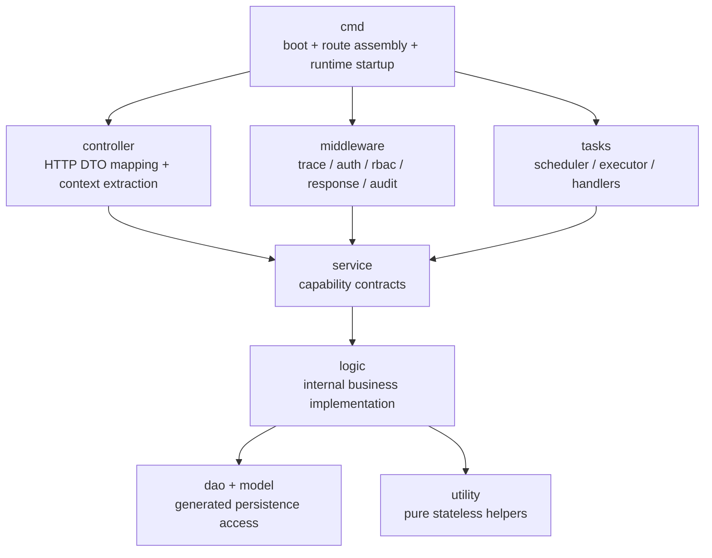

# HSK Exam Target Architecture

## Goal

Keep the current GoFrame style, but make responsibilities clearer:

- `cmd` only assembles routes and runtimes
- `middleware` only handles request policies
- `controller` only maps HTTP DTOs and context
- `service` exposes capability contracts
- `logic` implements business behavior and is not a public dependency
- `tasks` owns background runtime concerns
- `utility` stays for pure helpers only

## Target Structure



## Internal Layout

```text
internal/
  cmd/          # startup assembly only
  controller/   # request/response adaptation
  middleware/   # request policies and route rules
  service/      # capability contracts exposed across modules
  logic/        # internal business implementation, only behind service
  tasks/        # background runtime and handlers
  dao/          # gf gen dao generated access
  model/        # bo/do/entity/api structs
  utility/      # pure helper functions only
```

## Dependency Rules

- `controller -> service`, never `controller -> logic`
- `middleware -> service`, never `middleware -> logic`
- `tasks -> service`, never `tasks -> logic`
- `logic` is only the implementation side of `service`, not a public layer for cross-module imports

## This Optimization Round

1. Move HTTP route assembly out of `cmd.go`
2. Toolize middleware stacks into reusable chains
3. Refactor RBAC special handling from hard-coded branch chains into rule tables
4. Align audit module parsing with admin route structure
